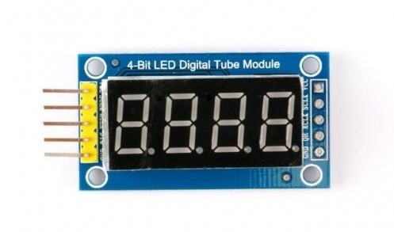

# **A 4-bit Led Digital Tube Module display easy to use library**  
  
![Build with PlatformIO](https://img.shields.io/badge/build%20with-PlatformIO-orange?logo=data%3Aimage%2Fsvg%2Bxml%3Bbase64%2CPHN2ZyB3aWR0aD0iMjUwMCIgaGVpZ2h0PSIyNTAwIiB2aWV3Qm94PSIwIDAgMjU2IDI1NiIgeG1sbnM9Imh0dHA6Ly93d3cudzMub3JnLzIwMDAvc3ZnIiBwcmVzZXJ2ZUFzcGVjdFJhdGlvPSJ4TWlkWU1pZCI+PHBhdGggZD0iTTEyOCAwQzkzLjgxIDAgNjEuNjY2IDEzLjMxNCAzNy40OSAzNy40OSAxMy4zMTQgNjEuNjY2IDAgOTMuODEgMCAxMjhjMCAzNC4xOSAxMy4zMTQgNjYuMzM0IDM3LjQ5IDkwLjUxQzYxLjY2NiAyNDIuNjg2IDkzLjgxIDI1NiAxMjggMjU2YzM0LjE5IDAgNjYuMzM0LTEzLjMxNCA5MC41MS0zNy40OUMyNDIuNjg2IDE5NC4zMzQgMjU2IDE2Mi4xOSAyNTYgMTI4YzAtMzQuMTktMTMuMzE0LTY2LjMzNC0zNy40OS05MC41MUMxOTQuMzM0IDEzLjMxNCAxNjIuMTkgMCAxMjggMCIgZmlsbD0iI0ZGN0YwMCIvPjxwYXRoIGQ9Ik0yNDkuMzg2IDEyOGMwIDY3LjA0LTU0LjM0NyAxMjEuMzg2LTEyMS4zODYgMTIxLjM4NkM2MC45NiAyNDkuMzg2IDYuNjEzIDE5NS4wNCA2LjYxMyAxMjggNi42MTMgNjAuOTYgNjAuOTYgNi42MTQgMTI4IDYuNjE0YzY3LjA0IDAgMTIxLjM4NiA1NC4zNDYgMTIxLjM4NiAxMjEuMzg2IiBmaWxsPSIjRkZGIi8+PHBhdGggZD0iTTE2MC44NjkgNzQuMDYybDUuMTQ1LTE4LjUzN2M1LjI2NC0uNDcgOS4zOTItNC44ODYgOS4zOTItMTAuMjczIDAtNS43LTQuNjItMTAuMzItMTAuMzItMTAuMzJzLTEwLjMyIDQuNjItMTAuMzIgMTAuMzJjMCAzLjc1NSAyLjAxMyA3LjAzIDUuMDEgOC44MzdsLTUuMDUgMTguMTk1Yy0xNC40MzctMy42Ny0yNi42MjUtMy4zOS0yNi42MjUtMy4zOWwtMi4yNTggMS4wMXYxNDAuODcybDIuMjU4Ljc1M2MxMy42MTQgMCA3My4xNzctNDEuMTMzIDczLjMyMy04NS4yNyAwLTMxLjYyNC0yMS4wMjMtNDUuODI1LTQwLjU1NS01Mi4xOTd6TTE0Ni41MyAxNjQuOGMtMTEuNjE3LTE4LjU1Ny02LjcwNi02MS43NTEgMjMuNjQzLTY3LjkyNSA4LjMyLTEuMzMzIDE4LjUwOSA0LjEzNCAyMS41MSAxNi4yNzkgNy41ODIgMjUuNzY2LTM3LjAxNSA2MS44NDUtNDUuMTUzIDUxLjY0NnptMTguMjE2LTM5Ljc1MmE5LjM5OSA5LjM5OSAwIDAgMC05LjM5OSA5LjM5OSA5LjM5OSA5LjM5OSAwIDAgMCA5LjQgOS4zOTkgOS4zOTkgOS4zOTkgMCAwIDAgOS4zOTgtOS40IDkuMzk5IDkuMzk5IDAgMCAwLTkuMzk5LTkuMzk4em0yLjgxIDguNjcyYTIuMzc0IDIuMzc0IDAgMSAxIDAtNC43NDkgMi4zNzQgMi4zNzQgMCAwIDEgMCA0Ljc0OXoiIGZpbGw9IiNFNTcyMDAiLz48cGF0aCBkPSJNMTAxLjM3MSA3Mi43MDlsLTUuMDIzLTE4LjkwMWMyLjg3NC0xLjgzMiA0Ljc4Ni01LjA0IDQuNzg2LTguNzAxIDAtNS43LTQuNjItMTAuMzItMTAuMzItMTAuMzItNS42OTkgMC0xMC4zMTkgNC42Mi0xMC4zMTkgMTAuMzIgMCA1LjY4MiA0LjU5MiAxMC4yODkgMTAuMjY3IDEwLjMxN0w5NS44IDc0LjM3OGMtMTkuNjA5IDYuNTEtNDAuODg1IDIwLjc0Mi00MC44ODUgNTEuODguNDM2IDQ1LjAxIDU5LjU3MiA4NS4yNjcgNzMuMTg2IDg1LjI2N1Y2OC44OTJzLTEyLjI1Mi0uMDYyLTI2LjcyOSAzLjgxN3ptMTAuMzk1IDkyLjA5Yy04LjEzOCAxMC4yLTUyLjczNS0yNS44OC00NS4xNTQtNTEuNjQ1IDMuMDAyLTEyLjE0NSAxMy4xOS0xNy42MTIgMjEuNTExLTE2LjI4IDMwLjM1IDYuMTc1IDM1LjI2IDQ5LjM2OSAyMy42NDMgNjcuOTI2em0tMTguODItMzkuNDZhOS4zOTkgOS4zOTkgMCAwIDAtOS4zOTkgOS4zOTggOS4zOTkgOS4zOTkgMCAwIDAgOS40IDkuNCA5LjM5OSA5LjM5OSAwIDAgMCA5LjM5OC05LjQgOS4zOTkgOS4zOTkgMCAwIDAtOS4zOTktOS4zOTl6bS0yLjgxIDguNjcxYTIuMzc0IDIuMzc0IDAgMSAxIDAtNC43NDggMi4zNzQgMi4zNzQgMCAwIDEgMCA0Ljc0OHoiIGZpbGw9IiNGRjdGMDAiLz48L3N2Zz4=)

Developed for the cheap and popular 7-segment 4 digits led displays (**_and for all the custom made displays as: GIANTS COUNTERS, TIMERS, PRICING DISPLAYS, etc._**)  based on two TM74HC595 (or similar) shift registers, the main focus was set on: ease of use, flexibility and basic prevention of 'misrepresentation' errors.

## Ease of use:
Instance the class passing just 3 parameters (the 3 pins connected to the display module), notify the object and it's ready to go: start ``.print()``ing the data to the display. There's no need of even setting the pin modes.  

## Flexibility:
Integers, floating point or strings they'll show as long as the display is capable of doing so in a trustworthy way. If you need to represent a percentage or level of completeness a ``.gauge()`` method is included to represent them in a "Old Motorola brick cell phones style".

## Trustworthy representation basic checking:
The representation of different types of data in this kind of displays is limited, and many implementations of the libraries to drive them take arbitrary or personally biased decisions on how to handle the problem.
The danger of misrepresenting values in the display are usually ignored so when a value can't be faithfully represented by the display, the data is rounded, floored, ceiled, sliced, characters are replaced by others or whatever criteria the developer defined. When trying to display the value __"90153"__ through the module, displaying __"9015"__ is no better (nor worse) than displaying __"0153"__, those are __misrepresentations__. This library returns a boolean value indicating if it was able to display a trustworthy representation of the value, as long as it is able to. If a trustworthy representation was not possible it will blank the display.  
## Crossplatform:
This kind of displays need to be periodically refreshed, as it can actively turn on only one digit at a time, so to keep all de digits visible the user must activate periodically each digit one by one independently to generate a "cinematic effect". The library takes care of this, and offers two solutions to do so.  
* The first is to attach the refreshing methods to a timer interrupt service (ISR) of the microcontroller.  
* The second is through methods that the user can call from the main code.  

The first mechanism frees the user from the load of calling the refreshing methods periodically, specially considering that long looping times (when executing **`for`**, **`while`** and **`do`** loops included), or the use of **`delay()`** could make the display flicker or simply stop until next refresh. The second option is given in the case that the timer/interrupt library used (see de dependencies information provided as I might change it in a future) doesn't support the architecture being used by the developer, or too many displays are already attached to the ISR that makes the system unstable. In any case the library is capable of working in any platform, using one way when possible, or the other always.  

# **Included Methods**

|Method | Parameters|
|---|---|
|**_TM74HC595LedTube_** |uint8_t **sclk**, uint8_t **rclk**, uint8_t **dio**|
|**begin()**|None|
|**blink()**|None|
||unsigned long **onRate** (,unsigned long **offRate**)|
|**clear()**|None|
|**fastRefresh()**|None|
|**fastSend()**|uint8_t **segments**, uint8_t **port**|
|**gauge()**|int **level** (, char **label**)|
||double **level** (, char **label**)|
|**getInstanceNbr()**|None|
|**getMaxBlinkRate()**|None|
|**getMinBlinkRate()**|None|
|**isBlinking()**|None|
|**isWaiting()**|None|
|**noBlink()**|None|
|**noWait()**|None|
|**print()**|String **text**|
||int **value** (, bool **rgtAlgn** (, bool **zeroPad**))|
||double **value** (, unsigned int **decPlaces** (, bool **rgtAlgn** (, bool **zeroPad**)))|
|**refresh()**|None|
|**send()**|uint8_t **segments**, uint8_t **port**|
|**setBlinkRate()**|unsigned long **newOnRate**, (unsigned long **newOffRate**)|
|**setWaitRate()**|unsigned long **newWaitRate**|
|**stop()**|None|
|**stop()**|None|
|**wait()**|(unsigned long **waitRate**)|
|**write()**|uint8_t **segments**, uint8_t **port**|
||String **character**, uint8_t **port**|

## **Methods definition and use description**

---
### **TM74HC595LedTube**(uint8_t **sclk**, uint8_t **rclk**, uint8_t **dio**)
### Description:  
Class constructor, create an instance of the class for each display to use. There's no need to configure the pins before calling the method, as the constructor takes care of the task.  
### Parameters:  
**sclk:** uint8_t (unsigned char), passes the pin number that is connected to the sclk pin of the display (the **SH_CP** pin of the shift register if working in a custom display). The pin must be free to be used as a digital output.  
**rclk:** uint8_t (unsigned char), passes the pin number that is connected to the rclk pin of the display (the **ST_CP** pin of the shift register if working in a custom display). The pin must be free to be used as a digital output.  
**dio:** uint8_t (unsigned char), passes the pin number that is connected to the dio pin of the display (the **DS** pin of the shift register if working in a custom display). The pin must be free to be used as a digital output.
### Return value:  
The object created.

### Use example:  
**`TM74HC595LedTube myLedDisp(6, 7, 10);`**

---
### **begin**();
### Description:
Attaches the display to a timer interrupt service, which takes care of refreshing the display regularly. Up to four displays can be attached to the ISR, at least theoretically, as the refreshing work takes time, and the time taken is proportional to the quantity of displays attached. And as ISRs literally interrupts other tasks done by the microcontroller, the time taken by the ISRs must be kept to minimal or the stability of the whole system will be compromised. As the time available to execute the ISRs without risking the stability of the system depends on various factors, the number of supported displays has to be tested in each development done. If the stability of the system is compromised then the displays exceeding the number of tolerated units will have to be refreshed by periodically using the **`refresh()`** method.
### Parameters:  
None
### Return value:  
true: If the display could be attached to the ISR, or if the display was already attached to it. This not ensures system stability.  
false: If the display couldn't be attached to the ISR, due to lack of free slots.  
### Use example:  
**`myLedDisp.begin();`**  

---
### **blink**();
### Description:
Makes the display blink the contents it is showing until a **`noBlink()`** method is invoked. The display will continue blinking even if the contents are changed. When invoking the method with no parameters the blinking is symmetrical, meaning that the time the display shows the contents and the time the display is blank are equal. The blinking starts at a preset rate the first time the method is invoked. The blinking rate can be changed by using the **`.setBlinkRate()`** method. After changing the blinking rate, the new blinking rate will be kept after a **`.noBlink()`** or new **`.blink()`** without parameters call is done, until it is modified with a new **`.setBlinkRate()`** call, or it is restarted by a **`.blink()`** with parameters. Note that to restart the blinking with a **`.blink()`** the service must first be stopped, as the method call makes no changes if the blinking service was already running.  
### Parameters:  
None
### Return value:  
true: If the display was not already set to blink (so now the blinking was started).  
false: The display was already set to blink.  
### Use example:  
**`myLedDisp.blink();`**

---
### **blink**(unsigned long **onRate**,unsigned long **offRate**);
### Description:
Makes the display blink the contents it shows until a **`noBlink()`** method is invoked. The blinking is **symmetrical** if only one parameter is passed, **asymmetrical** if two different parameters are passed, meaning that the time the display shows the contents and the time the display is blank will be equal (symmetrical) or not (asymmetrical), depending of those two parameters. The blinking starts at a passed rate when the method is invoked. The blinking rate can be changed by using the **`.setBlinkRate()`** method. The blink rate set will be kept after a **`.noBlink()`** or new **`.blink()`** without parameters call is done, until it is modified with a new **`.setBlinkRate()`** call, or it is restarted by a **`.blink()`** with parameters. Note that to restart the blinking with a **`.blink()`** the service must first be stopped, as the method makes no changes if the blinking service was already running.  
### Parameters:  
**onRate**: unsigned long integer containing the time (in milliseconds) the display must stay on, the value must be in the range _minBlinkRate <= onRate <= _maxBlinkRate. Those values might be known by the use of the **`getMinBlinkRate()`** and the **`getMaxBlinkRate()`** methods.  
**offRate**: optional unsigned long integer containing the time (in milliseconds) the display must stay off, the value must be in the range _minBlinkRate <= offRate <= _maxBlinkRate. Those values might be known by the use of the **`getMinBlinkRate()`** and the **`getMaxBlinkRate()`** methods. If no offRate value is provided the method will assume it's a symmetric blink call an use a value of offRate equal to the value passed by onRate 
### Return value:  
true: If the display was not already set to blink (so now the blinking was started).  
false: The display was already set to blink, and/or one or more of the parameters passed were out of range.  
### Use example:  
**`myLedDisp.blink(400);`** //Returns true and sets the blinking rate to 400 millisecs on, 400 millisecs off (symmetrical blink).  
**`myLedDisp.blink(800, 200);`** //Returns true and sets the blinking rate to 800 millisecs on, 200 millisecs off (asymmetrical blink)  
**`myLedDisp.blink(3000);`** //Returns false and the display stays without change.  

---
### **clear**();
### Description:
Clears the display, turning off all the segments and dots.
### Parameters:  
None
### Return value:  
None   
### Use example:  
**`myLedDisp.clear();`**

---
### **fastRefresh**();
### Description:
Refreshes the display, **only one digit per call**, the method takes care of registering which digit was redrawn last and move to the next until the last is reached and then restart from the first, and uses direct pin handling instead of using pre-built `shiftOut()` kind of methods. This working criteria has two consequences:
* The method works faster than redrawing all the digits each time and using the call to `shiftOut()` methods, so it is less time consuming and so is the most appropriate to be used within an ISR.
* When used by the developer to refresh the display from the code it must be called more frequently (starting with the four times needed to refresh all the digits of the display, and then doing those four calls periodically) to keep the display's cinematic effect. Failing to do so will be seen as display flickering, or some of the digits displayed more brighter than others.  
### Parameters:  
None
### Return value:  
None   
### Use example:  
**`myLedDisp.fastRefresh();`**

---
### **fastSend**(uint8_t **segments**, uint8_t **port**);
### Description:
Sends one character to the display, using direct pin handling instead of using pre-built `shiftOut()` kind of methods. The parameters indicate which character and to which digit will be sent. This is the method used by fastRefresh() to send the digit when it has to be refreshed. **_Keep in mind_** that sending a character directly to the display has no connection to keep it displayed as it must be resent periodically to keep the cinematic effect. Also the refresh() and fastRefresh() methods will overwrite the character sent, explicitly called or by the ISR service if started by the **`begin()`** method.  
### Parameters:  
**segments:** An unsigned short integer value representing which segments to turn on and which off to get the graphic representation of a character in the seven segment display, the corresponding value can be looked up in the **_charLeds[]** array definition in the header file of the library.  
**port:** An unsigned short integer value representing the digit where the character will be sent, being the range of valid values 0 <= port <= 3, the 0 value is the rightmost digit, the 1 value the second from the right and so on.
### Return value:  
None   
### Use example:  
**`myLedDisp.fastSend(0x88, 1);`** // Sends a capital A to the second digit from right to left.

---
### **gauge**(int **level**, char **label**);
### Description:
Displays a basic graphical representation of the level of fulfillment or completeness of a segmented value or task, gives a general fast notion on the matter, as a battery charge level, liquids deposit level, time remaining, tasks completeness and so on. The levels are represented by the horizontal segments (0, 1, 2 or 3 from bottom to top, and from left to right), and a character might be added before the graphical representation to give an indication of what the display is showing, passed through the **label** parameter. 
### Parameters:  
**level:** The integer value to display must be in the range 0 <= level <= 3.  
**label:** A char, optional parameter (if not specified the default value, a Space, will be assumed), that will be displayed in the leftmost digit of the display. The character must be one of the "displayable" characters, as listed in the **`.print()`** method description.
### Return value:  
true: If the value could be represented.  
false: Otherwise, being that the **level** parameter was out of range and/or the **label** parameter was not in the list of displayable characters, and the display will be blanked.

### Use example:  
**`myLedDisp.gauge(3);`**  
**`myLedDisp.**gauge(2, 'b');`**  
**`myLedDisp.**gauge(1, 'F');`**
**`myLedDisp.**gauge(4, 'd');`** //Error  
**`myLedDisp.**gauge(3, 'X');`** //Error  

---
### **gauge**(double **level**, char **label**);
### Description:
Displays a basic graphical representation of the level of fulfillment or completeness of a segmented value or task, gives a general fast notion on the matter, as a battery charge level, liquids deposit level, time remaining, tasks completeness and so on. The levels are represented by the horizontal segments (0, 1, 2 or 3 from bottom to top, and from left to right), and a character might be added before the graphical representation to give an indication of what the display is showing, passed through the **label** parameter. 
### Parameters:  
**level:** The double value to display must be in the range 0.0 <= level <= 1.0, being the range the representation of the percentage of the 'full' level, so that the ranges are:  
0.0 <= level < 0.25 for the first level,  
0.25 <= level < 0.50 for the second level,  
0.50 <= level < 0.75 for the third level, and  
0.75 <= level <= 1.00 for the fourth and upper level.  
**label:** A char, optional parameter (if not specified the default value, a Space, will be assumed), that will be displayed in the leftmost digit of the display. The character must be one of the "displayable" characters, as listed in the **`.print()`** method description.
### Return value:  
true: If the value could be represented.  
false: Otherwise, being that the **level** parameter was out of range and/or the **label** parameter was not in the list of displayable characters, and the display will be blanked.

### Use example:  
**`myLedDisp.gauge(0.0);`**  
**`myLedDisp.gauge(0.4);`**  
**`myLedDisp.gauge(0.55, 'b');`**  
**`myLedDisp.gauge(1.0, 'F');`**  
**`myLedDisp.gauge(1.5, 'd');`** //Error  
**`myLedDisp.gauge(3.0, 'X');`** //Error  

---
### **getInstanceNbr**();
### Description:
Returns an unsigned short integer value indicating the instantiation number it was given to the object. Each time the class is instantiated the created object receives a serial instantiation number that can be used in order to identify each object in case of need.
### Parameters:  
**None**  
### Return value:  
The unsigned short number indicating the identification Instance Number.  
### Use example:  
**`myLedDisp.getInstanceNbr();`**

---
### **getMaxBlinkRate**();
### Description:
Returns the maximum time the display can be configured to blink, helps keeping the BlinkRate setters inside the accepted range.
### Parameters:  
**None**  
### Return value:  
unsigned long integer: The maximum time, in milliseconds, the display can be set to blink. This value is the maximum to set as the turned-on or the turned-off stage of the blinking process started by a **`.blink()`** method.  
### Use example:  
**`myLedDisp.getMaxBlinkRate();`**

---
### **getMinBlinkRate**();
### Description:
Returns the minimum time the display can be configured to blink, helps keeping the BlinkRate setters inside the accepted range.
### Parameters:  
**None**  
### Return value:  
unsigned long integer: The minimum time, in milliseconds, the display can be set to blink. This value is the minimum to set as the turned-on or the turned-off stage of the blinking process started by a **`.blink()`** method.  
### Use example:  
**`myLedDisp.getMinBlinkRate();`**

---
### **isBlinking**();
### Description:
Returns a boolean value indicating if the display is set to blink or not.
### Parameters:  
**None**  
### Return value:  
true: If the display is set to blink.  
false: If the display is set not to blink.   
### Use example:  
**`myLedDisp.isBlinking();`**

---
### **isWaiting**();
### Description:
Returns a boolean value indicating if the display is set to wait or not. This might be useful as the display is unavailable to other **`.print()`**, **`write()`**, **`gauge()`**, etc. methods while its on "waiting" mode.
### Parameters:  
**None**  
### Return value:  
true: If the display is set to wait.  
false: If the display is set not to wait.   
### Use example:  
**`myLedDisp.isWaiting();`**

---
### **noBlink**();
### Description:
Stops the display blinking, if it was doing so, leaving the display turned on.
### Parameters:  
**None**  
### Return value:  
true: If the display was set to blink, and the blinking is stopped.   
false: If the display was not set to blink, no changes will be done.
### Use example:  
**`myLedDisp.noBlink();`**

---
### **noWait**();
### Description:
Stops the waiting in process display, if it was doing so, leaving the display turned on, blanked.
### Parameters:  
**None**  
### Return value:  
true: If the display was set to wait, and the waiting is stopped.   
false: If the display was not set to wait, no changes will be done.
### Use example:  
**`myLedDisp.noWait();`**

---
### **print**(String **text**);
### Description:
Displays the string text if it contains all "displayable" characters, which are the ones included in the following list: **0123456789AabCcdEeFGHhIiJLlnOoPqrStUuY-_.** and the **space**.  
There are other 3 characters that can be represented in the display, but the conversion from a character to use while programming is "host language setting dependant", so those where assigned to available ASCII non displayable characters of easy access in any keyboard layout in most languages, they can be used as part of the text string to display, and they are:  
* **=** Builds a character formed by lighting the lower 2 horizontal segments of the digit display, can be described as a "lower equal" symbol.  
* **~** Builds a character formed by lighting the 3 horizontal segments of the digit display, can be described as an "equivalent" symbol.  
* **'*'** (asterisk) Builds a character by lighting the upper 4 segments, forming a little square, can be described as the "degrees" symbol or º.  
### Parameters:  
**text:** String, up to four displayable characters long PLUS usable dots, all characters included in the representable characters list. Each valid character might be followed by a "." if needed, without being counted as a character, even spaces and special chars. If two or more consecutive dots are passed, an intermediate space is considered to be included between each pair of them, and that space counts as one of the four available characters to display.  
### Return value:  
true: If the text could be represented.  
false: Otherwise, and the display will be blanked.

### Use example:  
**`myLedDisp.print("Hi");`**  
**`myLedDisp.print("Strt");`**  
**`myLedDisp.print("L.O.L.");`**  
**`myLedDisp.print("36.7*");`**  
**`myLedDisp.print("....");`**  

---
### **print**(int **value**, bool **rgtAlgn**, bool **zeroPad**);
### Description:
Displays an integer value as long as the length representation fits the available space of the display.
### Parameters:  
**value:** The integer value to display which, due to the 4 digits limitations, must be in the range -999 <= value <= 9999.  
**rgtAlgn:** Boolean, optional parameter (if not specified the default value, false, will be assumed), indicates if the represented value must be displayed right aligned, with the missing heading characters being completed with spaces or zeros, depending in the zeroPad optional parameter. When a negative value is displayed and it's less than 3 digits long, a right aligned display will keep the '-' sign in the leftmost position, and the free space to the leftmost digit will be filled with spaces or zeros, depending in the zeroPad optional parameter.  
**zeroPad:** Boolean, optional parameter (if not specified the default value, false, will be assumed), indicates if the heading free spaces of the integer right aligned displayed must be filled with zeros (true) or spaces (false). In the case of a negative integer the spaces or zeros will fill the gap between the '-' sign kept in the leftmost position, and the first digit.  
### Return value:  
true: If the value could be represented.  
false: Otherwise, and the display will be blanked.

### Use example:  
**`myLedDisp.print(12);`** //Displays '**``12  ``**'  
**`myLedDisp.print(12, true);`** //Displays '**``  12``**'  
**`myLedDisp.print(12, true, true);`** //Displays '**``0012``**'    
**`myLedDisp.print(-12);`** //Displays '**``-12``**'  
**`myLedDisp.print(-12, true);`** //Displays '**``- 12``**'  
**`myLedDisp.print(-12, true, true);`** //Displays '**``-012``**'    

---
### **print**(double **value**, unsigned int **decPlaces**, bool **rgtAlgn**, bool **zeroPad**);
### Description:
Displays a floating point value as long as the length representation fits the available space of the display. If the integer part of value is not in the displayable range or if the sum of the spaces needed by the integer part plus the indicated decimal places to display is greater than the available digits space, the **`print()`** will fail, returning a false value and clearing the display.
### Parameters:  
**value:** The floating point value which, due to the 4 digits limitations must be in the range -999 <= value <= 9999 for the integer part, and in the range -99 <= value <= 999 if the representation of **at least** one decimal digit is intended.The range is limited to -9 <= value <= 99 for two decimal places. Negative numbers with three decimal places are not displayable due to the digit used by the **-** symbol, but positive numbers with one integer digit and 3 decimal places are.  
**decPlaces:** Decimal places to be displayed after the decimal point, ranging 0 <= decPlaces <= 3, selecting 0 value will display the number as an integer, with no '.' displayed. In any case the only modification that will be applied if value has a decimal part longer than the decPlaces number of digits is **truncation**, if any other rounding criteria is desired the developer must apply it to **value** before calling this method.
**rgtAlgn:** Boolean, optional parameter (if not specified the default value, false, will be assumed), indicates if the represented value must be displayed right aligned, with the missing heading characters being completed with spaces or zeros, depending in the zeroPad optional parameter. When a negative value is displayed and it's less than 3 digits long, a right aligned display will keep the '-' sign in the leftmost position, and the free space to the leftmost digit will be filled with spaces or zeros, depending in the zeroPad optional parameter.  
**zeroPad:** Boolean, optional parameter (if not specified the default value, false, will be assumed), indicates if the heading free spaces of the value right aligned displayed must be filled with zeros (true) or spaces (false). In the case of a negative value the spaces or zeros will fill the gap between the '-' sign kept in the leftmost position, and the first digit.  
### Return value:  
true: If the value could be represented.  
false: Otherwise, and the display will be blanked.
### Use example:  
**`myLedDisp.print(1.2, 2);`** //Displays '**``1.20 ``**'  
**`myLedDisp.print(1.2, 2, true);`** //Displays '**`` 1.20``**'  
**`myLedDisp.print(12, 2, true, true);`** //Displays '**``01.20``**'    
**`myLedDisp.print(-1.2, 2);`** //Displays '**``-1.20``**'  
**`myLedDisp.print(-1.28, 1, true);`** //Displays '**``- 1.2``**'  
**`myLedDisp.print(-1.28, 1, true, true);`** //Displays '**``-01.2``**'    
**`myLedDisp.print(-1.28, 3, true, true);`** //Error

---
### **refresh**();
### Description:
Refreshes the display, **all four digits per call**, the method takes care of registering which digit was redrawn first and each call starts from the next until the last is reached and then restart from the first, to minimize ghosting and keep all the digits brightness even, and uses pre-built **`shiftOut()`** kind of methods. This working criteria has two consequences:
* The method works slower than the **`fastRefresh()`**, so it will take more time to execute.  
* When used by the developer to refresh the display from the code it will avoid ghosting or blinking effects being called less frequently to keep the display's cinematic effect.  
### Parameters:  
**None**  
### Return value:  
**None**   
### Use example:  
**`myLedDisp.refresh();`**  

---
### **send**(uint8_t **segments**, uint8_t **port**);
### Description:
Sends one character to the display, using pre-built `shiftOut()` kind of methods, which takes unknown time to complete depending on the  implementation of the framework used to develop. The parameters indicate which character and to which digit will be sent. This is the method used by refresh() to send the digit when it has to be refreshed. **_Keep in mind_** that sending a character directly to the display has no connection to keep it displayed as it must be resent periodically to keep the cinematic effect. Also the refresh() and fastRefresh() methods will overwrite the character sent, explicitly called or by the ISR service if started by the **`begin()`** method.
### Parameters:  
**segments:** An unsigned short integer value representing which segments to turn on and which off to get the graphic representation of a character in the seven segment display, the corresponding value can be looked up in the **_charLeds[]** array definition in the header file of the library. Any other uint8_t (char or unsigned short int are equivalent terms here) value is admissible, but the displayed result might not be easily recognized as a known ASCII character.  
**port:** An unsigned short integer value representing the digit where the character will be sent, being the range of valid values 0 <= port <= 3, the 0 value is the rightmost digit, the 1 value the second from the right and so on.
### Return value:  
None   
### Use example:  
**`myLedDisp.send(0x91, 2);`** // Sends a Y to the third digit from right to left.

---
### **setBlinkRate**(unsigned long **onRate**,unsigned long **offRate**);
### Description:
Changes the time parameters to use for the display blinking the contents it shows. The parameters change will take immediate effect, either if the display is already blinking or not, in the latter case the parameters will be the ones used when a **`blink()`** method is called without parameters. The blinking will be **symmetrical** if only one parameter is passed, **asymmetrical** if two different parameters are passed, meaning that the time the display shows the contents and the time the display is blank will be equal (symmetrical) or not (asymmetrical), depending of those two parameters. The blink rate set will be kept after a **`.noBlink()`** or new **`.blink()`** without parameters call is done, until it is modified with a new **`.setBlinkRate()`** call, or it is restarted by a **`.blink()`** with parameters. Note that to restart the blinking with a **`.blink()`** the service must first be stopped, as the method makes no changes if the blinking service was already running.  
### Parameters:  
**onRate**: unsigned long integer containing the time (in milliseconds) the display must stay on, the value must be in the range _minBlinkRate <= onRate <= _maxBlinkRate. Those values might be known by the use of the **`getMinBlinkRate()`** and the **`getMaxBlinkRate()`** methods.  
**offRate**: optional unsigned long integer containing the time (in milliseconds) the display must stay off, the value must be in the range _minBlinkRate <= offRate <= _maxBlinkRate. Those values might be known by the use of the **`getMinBlinkRate()`** and the **`getMaxBlinkRate()`** methods. If no offRate value is provided the method will assume it's a symmetric blink call an use a value of offRate equal to the value passed by onRate 
### Return value:  
true: If the parameter or parameters passed are whiting the valid range, and the change takes effect.
false: One or more of the parameters passed were out of range. The rate change would not be made for none of the parameters.  
### Use example:  
**`myLedDisp.setBlinkRate(400);`** //Returns true and sets the blinking rate to 400 millisecs on, 400 millisecs off (symmetrical blink).  
**`myLedDisp.setBlinkRate(800, 200);`** //Returns true and sets the blinking rate to 800 millisecs on, 200 millisecs off (asymmetrical blink)  
**`myLedDisp.setBlinkRate(3000);`** //Returns false and the display blinking rate stays without change.  
**`myLedDisp.setBlinkRate(600, 3500);`** //Returns false and the display blinking rate stays without change.  

---
### **setWaitRate**(unsigned long **newWaitRate**);
### Description:
Changes the time parameter to use for the display to show the "progress bar advancement". The parameters change will take immediate effect, either if the display is already in wait mode or not, in the latter case the parameter will be the one used when a **`wait()`** method is called without parameters. The wait rate set will be kept after a **`.noWait()`** or new **`.wait()`** without parameters call is done, until it is modified with a new **`.setWaitRate()`** call, or it is restarted by a **`.wait()`** with parameters. Note that to restart the waiting with a **`.wait()`** the service must first be stopped, as the method makes no changes if the waiting service was already running.  
### Parameters:  
**newWaitRate**: unsigned long integer containing the time (in milliseconds) the display must take to advance the next character symbolizing the progress, the value must be in the range _minBlinkRate <= newWaitRate <= _maxBlinkRate. Those values might be known by the use of the **`getMinBlinkRate()`** and the **`getMaxBlinkRate()`** methods.  
### Return value:  
true: If the parameter passed is whiting the valid range, and the change takes effect.
false: The parameter passed was out of range. In this case the rate change would not be made.  
### Use example:  
**`myLedDisp.setWaitRate(400);`** //Returns true and sets the advancement rate to 400 millisecs.  
**`myLedDisp.setWaitRate(3000);`** //Returns false and the display wait rate stays without change.  

---
### **stop**();
### Description:
Detaches the display from the timer interrupt service which takes care of refreshing the display regularly (if it was attached to it). If the display wasn't attached to the ISR no modification is made. The method then checks the array (list) of active serviced displays, if none is left in that array, the timer service is stopped, and the interrupt used by it is released, to leave the resource available for other uses. This last action is reversed when a new begin() method is executed in any display.  
### Parameters:  
**None**  
### Return value:  
true: The instance of the display was found and detached from the ISR.  
false: The instance of the display wasn't found attached to the ISR, no detach was carried as it wasn't needed.  
### Use example:  
**`myLedDisp.stop();`**  

---
### **write**(uint8_t **segments**, uint8_t **port**);
### Description:
Prints one character to the display, at a desired position, without affecting the rest of the characters displayed.
### Parameters:  
**segments:** An unsigned short integer value representing which segments to turn on and which off to get the graphic representation of a character in the seven segment display, the corresponding value can be looked up in the **_charLeds[]** array definition in the header file of the library. Any other uint8_t (char or unsigned short int is the same here) value is admissible, but the displayed result might not be easily recognized as a known ASCII character.  
**port:** An unsigned short integer value representing the digit where the character will be sent, being the range of valid values 0 <= port <= 3, the 0 value is the rightmost digit, the 1 value the second from the right and so on.
### Return value:  
true: If the parameters are within the acceptable range, in this case 0 <= port <= 3.  
false: The port value was outside the acceptable range.  
### Use example:  
**`myLedDisp.write(0xA4, 1);`** // Modifies the displayed data, placing a '2' in the second digit from right to left.

### **wait**(unsigned long **newWaitRate**);
### Description:
Makes the display show an "simple animated progress bar" until a **`noWait()`** method is invoked. The speed rate for the progress animation starts at a passed rate when the method is invoked, or the last speed set will be used, having a preset value for the first time it's invoked if no parameter is passed. The animation rate can be changed by using the **`.setWaitRate()`** method. The speed rate set will be kept after a **`.noWait()`** or new **`.wait()`** without parameters call is done, until it is modified with a new **`.setWaitRate()`** call, or it is restarted by a **`.wait()`** with a parameter. Note that to restart the waiting with a **`.wait()`** the service must first be stopped, as the method makes no changes if the waiting service was already running.  
### Parameters:  
**newWaitRate**: Optional unsigned long integer containing the time (in milliseconds) the display must stay in the same advancement representation before moving on to the next, the value must be in the range _minBlinkRate <= newWaitRate <= _maxBlinkRate. Those values might be known by the use of the **`getMinBlinkRate()`** and the **`getMaxBlinkRate()`** methods.  
### Return value:  
true: If the display was not already set to wait (so now the waiting was started).  
false: The display was already set to wait, and/or the parameter passed was out of range.  
### Use example:  
**`myLedDisp.wait();`** //Returns true and shows advancement animation to the already set value.  
**`myLedDisp.wait(800);`** //Returns true and sets the advancement animation rate to 800 millisecs.  
**`myLedDisp.wait(3000);`** //Returns false and the display stays without change.  

---
### **write**(String **character**, uint8_t **port**);
### Description:
Prints one character to the display, at a desired position, without affecting the rest of the characters displayed.
### Parameters:  
**character:** A single character string that must be displayable, as defined in the **`.print()`** method.  
**port:** An unsigned short integer value representing the digit where the character will be sent, being the range of valid values 0 <= port <= 3, the 0 value is the rightmost digit, the 1 value the second from the right and so on.
### Return value:  
true: If **character** is a displayable one char string, and **port** value is in the range 0 <= value <= 3.  
false: The **character** was not "displayable" or the **port** value was out of range.  
### Use example:  
**`myLedDisp.write("J", 1);`** // Modifies the displayed data, placing a 'J' in the second digit from right to left.

